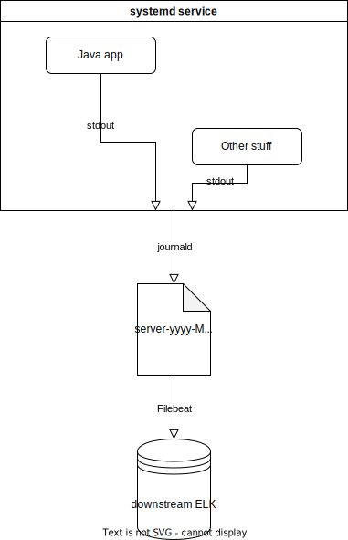

## Introduction

I know 'twas the season (of problems with logging), but this post is definitely not about the recent log4j 2.x vulnerabilities. With that out of the way...

Have you ever woken up and wondered "How can a combination of a specific log message in a Java app, log4j, journald, and Filebeat corrupt logs downstream?" No? Good, me neither. That should not be something to worry about, and yet it was for my team and me at work recently.

In the following text I'm going to detail my debugging process for the aforementioned problem. Initially I thought of it as merely a way to solidify my learning experience. Having read Julia Evans' [great debugging stories](https://jvns.ca/blog/2021/11/17/debugging-a-weird--file-not-found--error/) I now -- very humbly -- hope it could also make for an entertaining and enlightening story in general.

## Glossary

Logging in 2021 is quite the complicated matter, especially so in Java world where we always ask "What would an enterprise do?" I therefore thought it wise to first introduce some of the terms which I am going to use throughout this post.
* **(Log) Message**: The string that is produced by a `LOGGER.info("Hello, world!")` call, which would be something like `[2021-12-16 07:56:51,362] [INFO] [com.company.MyClass] Hello, world!`, depending on your pattern. So the message comprises the actual argument ("Hello, world!") plus contextual/meta information like log level, calling class, thread, etc.
* **Log event**: In the context of a logging library like log4j: The _message_ in its "disassembled" (or rather: not-yet-appended) state, i.e. the object holding all the (meta) information. It will first get formatted using a _layout_, then output by an _appender_ to a file, stdout, socket, etc. In the context of Filebeat/logstash: The _message_ plus host, environments, tags, etc. pp.
* **Msg**: The actual caller-input-text within a pattern. If our pattern was `[%d{ISO8601}] [%level] [%c] %m%n` and we called `LOGGER.info("Hello, world!")`, the msg would be equal to _Hello, world!_ and appear at the end of the _message_ (!), right after the class name (logger name).

## Body

### The Situation

End of 2021 our operations team approached us with a ticket detailing how we're sending them broken log events. This should not have happened. (Of course it shouldn't.) But it especially should not have happened right then because we had just recently completely revised and vetted our logging stack in order to actually send the logs to the ops team's ELK stack instead of our own one (that we can now get rid of). After a transitional period we were pretty sure all our logs were fine for downstream consumption. (Meaning: There had been a few "Your logs are broken _again_, folks"-tickets until mid December.)

The log event in question was emitted by an old Java application that is due for sunset in the first quarter of 2022 (fingers crossed). The event was fine expcept for its message which looked like this from ops team's end:
```txt
[2021-12-16 07:56:51,362] [WARN] [com.company.MyClass] [{id,12345}}]\njava.lang.NullPointerException\nat com.company.MyClass.myMethod(MyClass.java:107)\nat ... \nat com.company.App.main(App.java:199)
```
(Simplified, yet still as ugly as the original one)

**Why would our log pattern break like this? Shouldn't there be a space between the `]` and the `\n`? And why does the message start with a line break in the first place?**

### Low Hanging Fruits First: Line breaks?

If I haven't really got a clue I like to first check off the so-called _low hanging fruits_: What can I, with comparatively little effort, verify to be true or false in regards to the problem at hand? Sometimes this actually uncovers the issue, and, even when we're not that lucky, it at least helps to isolate the problem. Now I don't have many years of experience, but I do recognize _some_ patterns that give me pointers as to which the low hanging fruits in our problem space actually are. Here it looked like there was some text missing due to a line break issue since the msg part of log messages usually does not start with a line break followed by stacktrace.

Fortunately, I could just `rsync` the actual logfile from the server the app is running on and look at the log message's context: Was there another log message directly before the one we were supplied in the ticket that, when combined, makes for the full message which should not have been split up in the first place?

This is what I got from the server:
```txt
[2021-12-16 07:55:02,123] [INFO] [com.company.MyOtherClass] [{id,12345}}] I am an unrelated message, not helpful to solving the problem at hand.
[2021-12-16 07:56:51,362] [WARN] [com.company.MyClass] [{id,12345}}]
java.lang.NullPointerException
at com.company.MyClass.myMethod(MyClass.java:107)
at ...
at com.company.App.main(App.java:199)
[2021-12-16 07:57:19,563] [INFO] [com.company.MyOtherOtherClass] [{id,12345}}] I, too, am unrelated.
```
No matching event right before, or even in the the last n events before the one we're looking at, just the single broken log message. No related events afterwards, either.

Now at this point in time, there was little reason to venture deep into the appender code assuming the appender is doing its appending incorrectly. That would be digging up potatoes from frozen ground instead of picking off the delicious low hanging cherries. Instead I moved on to the next easy task to check off our list: Producing the logs locally in order to verify whether the application itself messed up the logs somehow. In my local stdout, the logs are similar if not completely the same, though (note the whitespace):

```txt
[2021-12-16 07:56:51,362] [WARN] [com.company.MyClass] [{id,12345}}] 
    java.lang.NullPointerException
    at com.company.MyClass.myMethod(MyClass.java:107)
    at ...
    at com.company.App.main(App.java:199)
```

Also, the same non-related logs before and after. These findings supported the **two assertions**: 
1. The problem wasn't caused by some transmission irregularities on the server when capturing the app's stdout and sending it off to the actual logfile. 
2. It wasn't an issue with handling of line breaks that we are dealing with.

I was still puzzled, however, by the log message itself. It just looks really wonky, with the first line missing any message.

### Digging Deeper
Since we're in the IDE already, why not actually look at the code that caused the log statement: A `LOGGER.warn(e.getMessage(), e)` invocation in a `catch`-block. On the surface a piece of old code, nothing too eyebrow-raising about it. (Yes, I'm aware of _warning_ about an exception, it actually makes sense here, okay!?) Nowadays however we'd probably write it like this:

```java
try {
    theThing();
} catch (Exception e) {
    LOGGER.warn("Encountered problem doing the thing, which actually isn't too bad", e);
}
```

A little text helps with putting the exception in the context of the business logic. Also, with our logging library we get the exception's message when supplying the `e` argument, anyways.

While ruminating about the code in question, I noticed the first line of the logged message is supposed to have the exception's message in it, but in our example it's absent. Why? The caught exception does not have a message and `e.getMessage()` therefore yields `null`. Putting all the pieces of information together I was able to **assert two more things**: 

1. The log message _when emitted by the app_ actually conforms to the pattern, which is `[%d{ISO8601}] [%level] [%c] [%X] %m%n`, by the way: First the meta info (ISO 8601 timestamp, logging level, logging class, thread-context-map/MDC), then the msg; all separated by a space; at the end a line break.
2. In addition, the `null` argument does not cause any trouble since this great open source logging library that we're using does the sanest thing in such a situation and inserts an empty string as the log message's actual `msg`/`%m` part.

So how the hell do we go from "a bit funny looking, but spec-conforming log message" to the garbled mess we received in our bug ticket?

### Widening the Context Again

I had now arrived at a stage where I had exhausted both all the easy-to-think-of, easy-to-verify leads and, moreover, already failed once trying to find the issue by doing one deeper dive into the code. Time for a more systematic approach. We need to connect all the ~~logs~~ dots between application and the downstream ELK stack. In short: What happens after the application's log appender has appended the log message?

In our case, the Java app is a simple jar invoked from a systemd service on a Linux system. This service's logs are collected from stdout by journald, then appended to the actual logfile. Filebeat picks up the logfile's changes and sends them off to the ops team. Rather convoluted, I know, but it works pretty reliably. And no, we wouldn't build it like this again. We'd write it in Go, then rewrite it in Rust, then put all our logs on the blockchain, and then, after the Great Cloud Collapse of 2030, we'd think using a plain Linux VM and systemd wasn't so bad, after all, and revert it to the current state. (Barring the fact that we now might know of a [journald input plugin for Filebeat](https://www.elastic.co/guide/en/beats/filebeat/7.16/filebeat-input-journald.html).)



There are three major links where things could go awry: 
1. The one between the application resp. the systemd service and the log file, 
2. the one between the logfile and our local Filebeat instance,
3. and the one between our Filebeat instance and the downstream ELK stack. 

I chose to probe into the second link first because that was the easiest check thanks to docker.

### Et tu, Filus Beatus?

So I _did a Docker_ (hope that settles as a figure of speech) with a Filebeat config similar to the server's one and that essentially comes down to this:
```yaml
filebeat.inputs:
  - type: log
    paths:
      - "/usr/share/filebeat/broken.log"
    multiline:
      pattern: '^\[\d{4}-\d{2}-\d{2}'
      negate: true
      match: after
    include_lines: ['^\[\d{4}-\d{2}-\d{2}']

processors:
    # processors be here.

output.console:
  codec.json:
    pretty: true
    escape_html: false
```

First I put the abridged logfile content from the server directly into Filebeat's input, the broken.log file. The result was _drumroll_ ... _more drumdroll_:
```json
{
  // lots of metadata
  "message": "[2021-12-16 07:56:51,362] [WARN] [com.company.MyClass] [{id,12345}}]\njava.lang.NullPointerException\nat com.company.MyClass.myMethod(MyClass.java:107)\nat ... \nat com.company.App.main(App.java:199)",
  // more metadata
}
```
Ha! Naughty naughty, Mr. Filebeat, making a mess of our logs like that. I was happy I had finally reproduced the behaviour.But, for good measure, since I took the time of setting the little experiment up so nicely, I ran another one. This time I used the application's logs as input. And THE LOG MESSAGE COMES OUT JUST FINE:
```json
{
  ...
  "message": "[2021-12-16 07:56:51,362] [WARN] [com.company.MyClass] [{id,12345}}] \njava.lang.NullPointerException\nat com.company.MyClass.myMethod(MyClass.java:107)\nat ... \nat com.company.App.main(App.java:199)",
  ...
}
```
Huh?

### Space -- The Final Frontier

Let's summarize our recent findings:
* If Filebeat is fed the log message _from the server's log file_ it emits a log event with the kind of garbled message that gets us into trouble.
* If Filebeat is fed the same log message _from the application's log file_ (I know it technically doesn't exist as we log to stdout directly, but that distinction if of no consequence here) everything is fine and dandy.

And what was the difference again between those two message sources? Lots of precious ~~spice~~ space. For that reason such a bug is called a _space condition_. (No it isn't, but it'd be neat, wouldn't it?)

And who raked all the whitespace to themselves?


("If it wasn't for you meddling kids I'd have garbled the logs forever!")

journald [trims trailing whitespace](https://github.com/systemd/systemd/issues/98), which actually can be a quite sensible thing to do. And it operates on a per-line-basis, also sensible in that context. Those two decisions do _not_, however, get along with multiline log messages whose first line ends in a trailing space.

That means Filebeat saw the multiline log message like so:

| Line       | Message                                                              |
|------------|----------------------------------------------------------------------|
| 1          | `[2021-12-16 07:56:51,362] [WARN] [com.company.MyClass] [{id,12345}}]// <-- No Trailey McSpaceFace before "//" because journald trimmed it`|
| 2          | `java.lang.NullPointerException`                                      |
| 3          | `at com.company.MyClass.myMethod(MyClass.java:107)`                    |
| ... | ...                                                                  |
| N          | `at com.company.App.main(App.java:199)`                               |

It then went on to assemble those according to its multiline pattern, basically inserting a `\n` after each line of the group. And behold, our pile of logshit: The removal of trailing whitespace in this case managed to break our whole log pattern.

This was because the space it removed was, due to the absence of an actual msg, not any irrelevant superfluous whitespace at the end of the log message, after the _msg_. It removed the _semantical_ space that differentiates the last piece of meta information (`[{id,12345}}]`) from the msg itself! Not a problem in the 99% of cases where we have neither an empty msg nor a multiline message, nor both -- which made the bug appear only now, after such a long time of the app running smoothly.

### The Fix

I am absolutely not blaming journald here. It's expected, and documented (!) behavior. Also, the systemd stack receives enough unjustified hate already. We only have ourselves to blame. (Note the convenient shift from "I" to "we", hehe.)

One potential fix could have been to reconfigure journald or to get rid of it entirely. This did not seem like time well invested. So instead we went by what is considered best practice by the authors of slf4j, another champion of Java logging, and [just included a meaningful message with the logged exception](https://www.slf4j.org/faq.html#exception_message) instead of the useless `e.getMessage()`. Of course we also checked for other occurrences of this anti-pattern.

Does this rule out similar problems in the future? No, our stack can still not deal with multiline log messages where the first line's msg part is absent. But the fix was cheap and the chance of something like that happening again are pretty slim.

## Conclusion

I'm tired of logging. Can I please go back to debugging broken builds? :)