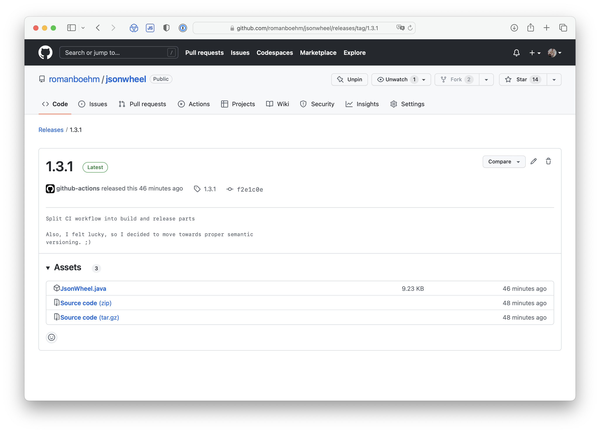

## Update 2023-04-18
The below post is relevant anymore only for historic reasons. Contrary to my statement below, JReleaser does indeed offer the possibility to [distribute source files](https://fosstodon.org/@jreleaser/109676555681811519). In combination with Maven Release plugin, I was able to standardize the whole workflow, which made distributing `JsonWheel.java` and upgrading versions much easier.

## Introduction

For my single-source-file-no-dependencies JSON parser for the JVM, [JSON Wheel](https://github.com/romanboehm/jsonwheel), I was looking for a better way for distribution other than a bunch of convoluted, homegrown shell scripts, or modifying and uploading files manually to GitHub releases. With a release cadence of like one-and-a-half releases a year, who has time for that? 

It should be done the proper way: More Java, more enterprise, more YAML, stuff happening automatically in CI, no manual work. Now, with for anything _but_ a source distribution, I'd fumble around with the apparently great [JReleaser](https://jreleaser.org) (haven't tried it yet). This one currently doesn't offer distributing plain source files, however. So I set out to do that myself.

## The Source File To-be-distributed

Firstly, I needed a way to prepare `src/main/java/com/romanboehm/jsonwheel/JsonWheel` for release, which contains of removing the package declaration. In my mind, that step is part of Maven's `package` phase and should be able to be run locally. Since there's no maven plugin for handling source-distributions -- and I mean actually distributing a source file only, not distributing a sources jar --, I used the [Exec Maven Plugin](https://www.mojohaus.org/exec-maven-plugin/) in combination with the small utility program `PrepareRelease.java`.

### Exec Maven Plugin

```xml
<build>
    <plugins>
        ...
        <plugin>
            <groupId>org.codehaus.mojo</groupId>
            <artifactId>exec-maven-plugin</artifactId>
            <version>${exec-maven-plugin.version}</version>
            <executions>
                <execution>
                    <phase>package</phase>
                    <goals>
                        <goal>exec</goal>
                    </goals>
                </execution>
            </executions>
            <configuration>
                <executable>java</executable>
                <arguments>
                    <argument>PrepareRelease.java</argument>
                </arguments>
            </configuration>
        </plugin>
    </plugins>
</build>
```

Here, we bind the `exec` goal of the plugin to the `package` phase to run `PrepareRelease.java`. 

### PrepareRelease.java
This small Java script (heh) creates a copy of JsonWheel.java without the original package declaration, so one can insert the source code without any namespace conflicts.

```java
import java.io.IOException;
import java.nio.file.Files;
import java.nio.file.Path;
import java.nio.file.StandardOpenOption;

class PrepareRelease {

    private static final Path DEST = Path.of("target/distribution");
    private static final Path SRC = Path.of("src/main/java/com/romanboehm/jsonwheel");

    public static void main(String[] args) throws IOException {
        var withoutPackageDecl = Files.readAllLines(SRC.resolve("JsonWheel.java")).stream()
                .skip(2)
                .toList();
        Files.createDirectories(DEST);
        Files.write(
                DEST.resolve("JsonWheel.java"),
                withoutPackageDecl,
                StandardOpenOption.CREATE
        );
    }
}
```

As a result, we now provide the source file we want to upload later under `target/distribution/JsonWheel.java`.

## Creating a Release

GitHub actions does the heavy lifting here:

```yaml
name: build and release
on: [push]

jobs:
  build:
    runs-on: ubuntu-latest
    steps:
      - name: checkout
        uses: actions/checkout@v3
      - name: set up JDK 17
        uses: actions/setup-java@v3
        with:
          java-version: '17'
          distribution: 'adopt'
      - name: build with Maven
        run: ./mvnw --batch-mode package
      - name: upload source distribution
        if: startsWith(github.ref, 'refs/tags/')
        uses: actions/upload-artifact@v3
        with:
          name: source-distribution
          path: target/distribution/JsonWheel.java
  release:
    if: startsWith(github.ref, 'refs/tags/')
    needs: build
    runs-on: ubuntu-latest
    steps:
      - name: download source distribution
        id: download-source-distribution
        uses: actions/download-artifact@v3
        with:
          name: source-distribution
          path: JsonWheel.java
      - name: Release source file
        uses: softprops/action-gh-release@v1
        with:
          files: ${{steps.download-source-distribution.outputs.download-path}}/JsonWheel.java
```

The `build` job will be run on every push, not only for tag refs. It compiles, tests, and packages the application. As we noted above, `package` will also provide `target/distribution/JsonWheel.java` _if we have a tag ref_. This is the artifact we want to upload for usage in other jobs.

`release` is the job which is actually concerned with providing the proper GitHub release. It will only run if the detected ref is a tag, e.g. `1.3.1` and only after `build` has finished. 

When it does run, it downloads the previously uploaded file and hands it over to the release step, provided by `softprops/action-gh-release`. Note the file path for `with.files`: The `download-source-distribution` part in the variable's name references has to match the download step's `id`.

The `action-gh-release` ([GitHub](https://github.com/softprops/action-gh-release/)) then takes care of creating a release, converting the commit messages to a changelog and placing the source file there.



## Next Step

Currently, I maintain the project version through both the pom.xml file's `project.version` property and git tags, which isn't great. When I feel like this causes too many headaches, I might revisit this issue, maybe even create a proper GitHub issue for it.