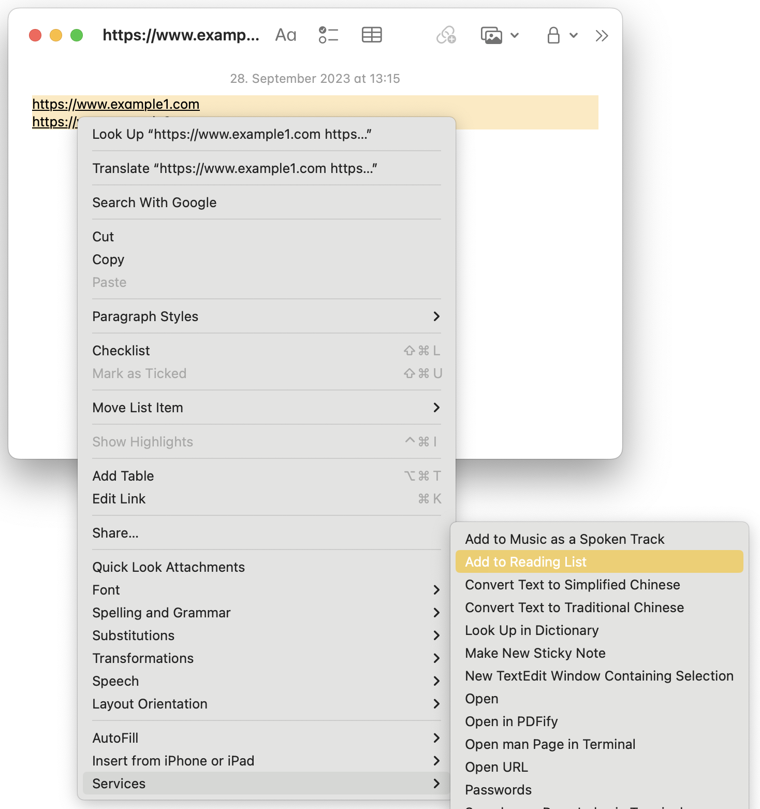

## Problem

I had recently dissolved some third-party reading list of mine and wanted to migrate all these yet unread articles and blog posts into Safari's reading list. I was looking for some kind of bulk import functionality in Safari itself, but only found the option to add multiple tabs to the reading list. With my former list containing over 300 items, that wasn't the way to go.

## Solution

Luckily, MacOS' _Notes_ app offers a way to bypass the need to open hundreds of tabs, provided you have the reading list items available as a new line-separated list of links. If so, simply

1. paste your links into a new note,
2. select all links,
3. right-click on any line,
4. select _Services_ -> _Add to Reading List_.

Done. ✅

Here's a screenshot of how it should look:

