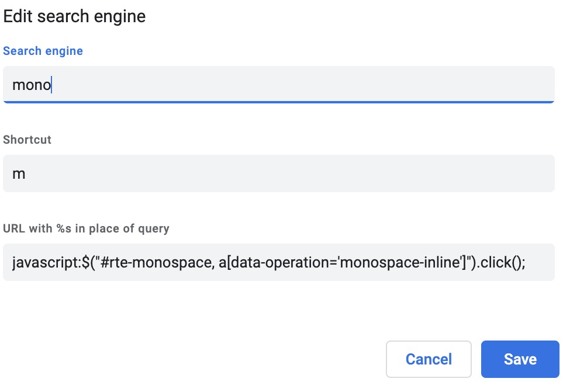

## Problem

Confluence and Jira, at the least in the versions we use at my work, do not offer shortcuts for monospace formatting. You can type two opening curly brackets followed by \<text\> followed by two closing curly brackets, and that will render \<text\> monospaced. But that does not work for applying formatting later one.

## Solution

There's a nice, generic workaround for problems like these: [Bookmarklets](https://en.wikipedia.org/wiki/Bookmarklet). They live as bookmarks in your browser, but you can see them as buttons being able to execute JavaScript on click.

The lack-of-monospace-formatting-shortcut problem could be solved for both Jira and Confluence with a bookmarklet executing the following code:
```javascript
javascript:$("#rte-monospace, a[data-operation='monospace-inline']").click();
```
This is jQuery, with the selectors for the `click` function picking up either the id of the "monospace" entry in the formatting dropdown of Confluence's editor -- `#rte-monospace`. Or, for Jira, a link with the specific attribute-value-combo of `data-operation='monospace-inline'`. (Actually the JavaScript snippet will emit click events for both, but both elements will never appear on the same page.)

You can easily adapt this for other editors by replacing the selectors with the one(s) appropriate for the specific editor.

## Shortcuts?

Now, bookmarklets alone wouldn't help if we needed to click them. Then we might just as well click on the editor's dropdown. What we need are shortcuts!

### Firefox

Firefox, being in general a good citizen of the web, allows to assign a shortcut directly to any bookmark. What I didn't like about Firefox's bookmarklet implementation were the confirmation popups on clicking them the last time I checked. This takes a lot of speed out of the solution.

### Chromium-based Browsers

Chrome et. al. don't allow custom shortcuts for bookmarks, but they offer the possibility to create custom search engines. Which, in turn, can be assigned to text-based shortcuts that you type into the URL bar.

Mine looks like so:



In order to apply the formatting, I press 

1. ⌘-L to focus the URL bar, 
2. m (the key) to pull up the correct search engine (i.e. script), then 
3. ⏎ to execute the script.

Not quite like a ⌘-⇧-m, but good enough.