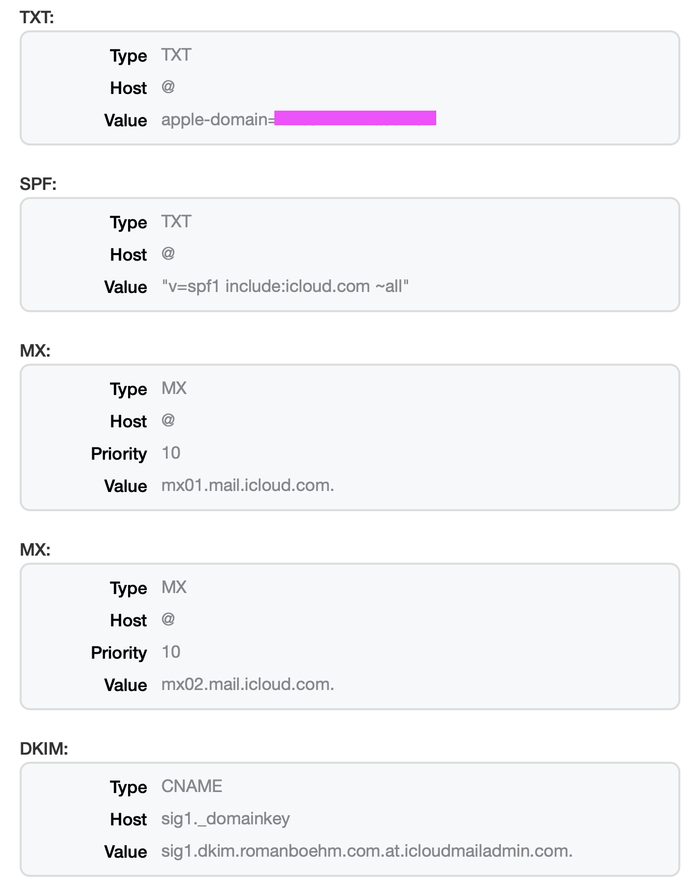
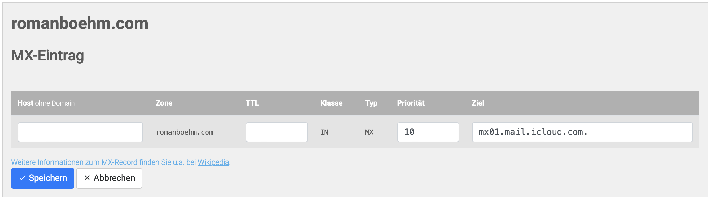
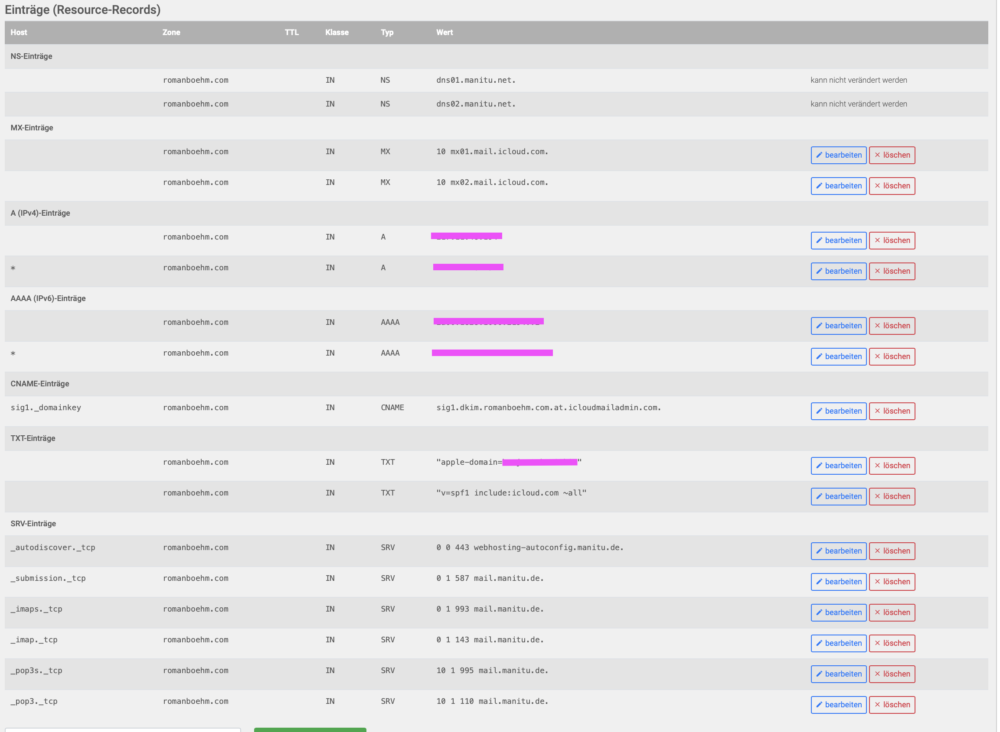

## Introduction

How to: Set up a custom domain for iCloud mail using a Manitu domain

I'm using the German hoster [Manitu](https://www.manitu.de) for the romanboehm.com domain. I also have an iCloud+ subscription [allowing me to use this domain for iCloud mail](https://www.icloud.com/icloudplus/customdomain). I found the process of setting that up quite under-supported on both iCloud and Manitu's side, so I wanted to document it. [A German-speaking blogger named Steven Kaminsky apparently had encountered the same pains in the past](https://bazomg.de/index.php/2022/01/eigene-domain-in-icloud-mail-nutzen/), and the linked post was of great help, but I still wanted to quickly persist my notes on the process and highlight potential hiccups with Manitu especially. For my sake and fellow Manitu-with-iCloud+ users'.

## Notes

1. For the following instructions I'm going to assume you've successfully made it past the initial stages of subscribing to iCloud+ and entering your domain there. 

2. Base your changes on the **personalized** DNS records iCloud+ gave you through email or your iCloud+ domain settings page. They should look like this:

    

3. Common pattern for entering all but the DKIM record on Manitu's side: Leave the _Host_ part blank. Manitu does not allow you to enter the _@_ sign. And if you enter your domain, as suggested by iCloud's support page, Manitu will ask for confirmation whether that's what you want because then you'd end up with a duplicate host. So, leave it blank, Manitu will automatically fill in e.g. _romanboehm.com._ as you can verify by again downloading your DNS records later.

    
    The corresponding entry in you downloaded records file would show
    ```txt
    romanboehm.com. 86400 IN MX	10 mx01.mail.icloud.com.
    ```

## Steps

Now you should be ready to enter the DNS settings you've been presented with into [Manitu's Forward DNS settings page](https://mein.manitu.de/domain/forwarddns/). As for the individual changes:

### MX
For the MX records, first delete existing MX records. Then go ahead and create the new ones by copy-and-pasting the values which iCloud requires into the _Ziel_, i.e. target input element. As mentioned, leave the _Host_ input blank.

### TXT
For the TXT record given by iCloud, add a new TXT record, copy and paste the value given by iCloud, i.e. the _apple-domain=random-characters_ string. It will appear double-quoted once you save the record, that's fine! Host: blank.

### SPF
For the SPF record, create another _TXT_ record. Only this time, strip the string given to you by iCloud off the quotes. Manitu does the double-quoting here already. You can see the "SPF" TXT record having the value _"v=spf1 include:icloud.com ~all"_ if you did it right.  Host: blank.

### DKIM
Lastly, for the DKIM record, create a new _CNAME_ record with _sig1.\_domainkey_ as the _Host_ and the _personalized value from the mail sent to you or the personalized instructions page_. This is important because should you go by the [general support page on custom domains for iCloud mail](https://support.apple.com/en-gb/HT212524), it will present to you a value which looks deceivingly close to something you could just paste in, but looking closely, it has an _example.com_ part for the domain. There are people to which this allegedly has happened, and it took them a long time to figure it out...

### Finish
After all that, the Manitu DNS page for your domain should look something like this:



Hit _Speichern_, i.e. save the modifications you've just made. Then verify through the iCloud+ custom domain verification mechanism all is to iCloud's satisfaction. It should be.


